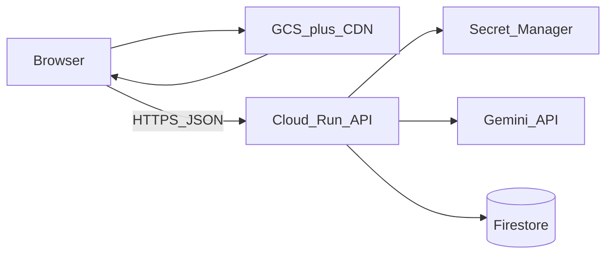
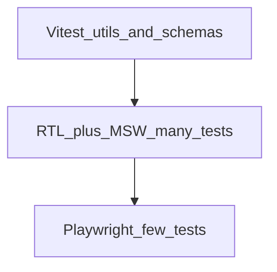
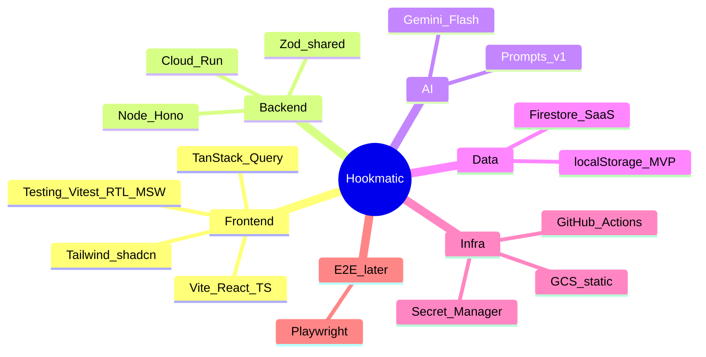

# Hookmatic — arsitektur, stack, dan langkah

## Wawasan penting tentang “web app di GCS”

**Google Cloud Storage hanya bisa melayani file statis** (HTML, JS, CSS, gambar). Itu cocok untuk frontend modern (Vite/React build → upload bucket).

Yang **tidak bisa** di GCS saja:

- Memanggil Gemini dengan API key (key akan bocor di browser)
- Rate limiting, billing per user, prompt yang “rahasia”
- Menyimpan history generation di server

Jadi pola yang benar untuk Hookmatic:




Frontend di bucket (opsional: **Cloud CDN** + domain + HTTPS). Semua “otak” AI lewat **backend kecil** di GCP.

### Keputusan stack (locked)


| Area                       | Pilihan                                                                              |
| -------------------------- | ------------------------------------------------------------------------------------ |
| Frontend                   | React + Vite + TypeScript                                                            |
| **Backend**                | **Node.js 22 + TypeScript + Hono** (Cloud Run)                                       |
| AI                         | Google Gemini                                                                        |
| DB MVP → SaaS              | localStorage → Firestore                                                             |
| Hosting UI                 | GCS (static)                                                                         |
| **Testing frontend**       | **Vitest + React Testing Library + MSW** (daily); **Playwright** (E2E tipis, fase 5) |
| Testing API                | Vitest + Hono in-memory; Gemini di-mock                                              |
| **Visualisasi arsitektur** | **Mermaid** di `docs/` (mindmap + flow + sequence) — terkonfirmasi                   |


Alternatif backend (Python, Go, Workers) tidak dipakai untuk implementasi ini; tetap tercatat di plan sebagai referensi belajar.

---

## Stack yang disarankan (selaras frontend dev + belajar + SaaS-ready)

### Frontend (prioritas skill kamu)


| Lapisan             | Pilihan                            | Alasan                                                                    |
| ------------------- | ---------------------------------- | ------------------------------------------------------------------------- |
| Framework           | **React 19 + Vite + TypeScript**   | Standar industri, build cepat, output statis sempurna untuk GCS           |
| Routing             | **React Router**                   | Cukup untuk MVP; nanti bisa pindah ke Next hanya jika butuh SSR/SEO berat |
| UI                  | **Tailwind CSS + shadcn/ui**       | Komponen siap pakai, looks “product”, bagus untuk portfolio               |
| State / server data | **TanStack Query**                 | Cache request generate, loading/error, retry                              |
| Forms               | **React Hook Form + Zod**          | Validasi input niche/platform/tone                                        |
| Auth (fase 2)       | **Firebase Auth** (Google sign-in) | Satu ekosistem GCP; token JWT ke Cloud Run                                |


**Alternatif jika ingin lebih “full-stack React”:** Next.js di **Cloud Run** (bukan GCS) — lebih kompleks untuk belajar hosting statis; untuk goal kamu, **Vite + GCS** lebih jelas pemisahan frontend/backend.

### Backend (Node.js — terkonfirmasi)


| Lapisan              | Pilihan                              | Alasan                                                                                                          |
| -------------------- | ------------------------------------ | --------------------------------------------------------------------------------------------------------------- |
| Runtime              | **Node 22 + TypeScript**             | Satu bahasa dengan frontend; shared Zod di monorepo                                                             |
| Framework            | **Hono** (atau Fastify)              | Ringan, cocok Cloud Run, mudah test                                                                             |
| Deploy               | **Cloud Run**                        | Pay-per-use, scale-to-zero, path natural ke SaaS                                                                |
| AI                   | `**@google/generative-ai**` (Gemini) | Sesuai pilihan kamu; model awal: **gemini-2.0-flash** (cepat/murah) atau **gemini-2.5-pro** untuk kualitas hook |
| Secrets              | **Secret Manager**                   | `GEMINI_API_KEY` tidak pernah di repo                                                                           |
| Auth verify (fase 2) | Firebase Admin SDK di Cloud Run      | Middleware: optional auth MVP → required auth SaaS                                                              |


**Endpoint MVP (contoh):**

- `POST /v1/generate` — body: `{ platform, niche, audience, tone, language, count }` → `{ hooks: [...] }`
- `GET /health` — untuk monitoring
- Fase 2: `GET/POST /v1/projects`, `GET /v1/history`

### Kenapa Node.js — bukan karena “wajib”

Node dipilih sebagai **default belajar**, bukan karena Hookmatic butuh performa Node khusus. Backend kamu tipikal: **validasi JSON → panggil Gemini → kembalikan JSON** — workload I/O-bound, semua runtime di bawah cocok.

**Alasan Node + TS untuk frontend developer:**

- **Satu bahasa + types** dengan React (Zod schema bisa di `packages/shared` dipakai web & api).
- **Monorepo pnpm** alami: satu lockfile, script `dev` parallel.
- SDK Gemini resmi (`@google/generative-ai`) dan contoh Cloud Run + Firebase Admin paling banyak di ekosistem JS/TS.
- Cold start Cloud Run untuk bundle Node kecil (Hono) **cukup baik**; bukan bottleneck untuk MVP.

**Kapan Node bukan pilihan terbaik:** jika tujuan utama belajar **Python/Go**, atau nanti ada **job queue / worker berat** — tetap bisa, tapi stack beda.

### Alternatif backend (semua valid di Cloud Run + Gemini)


| Opsi                           | Framework contoh                             | Plus                                                 | Minus untuk kamu                                                           |
| ------------------------------ | -------------------------------------------- | ---------------------------------------------------- | -------------------------------------------------------------------------- |
| **Node + TS** (rencana)        | Hono, Fastify                                | Shared types dengan frontend; kurva belajar flat     | Bukan “backend murni” jika ingin lepas dari JS                             |
| **Python**                     | FastAPI                                      | Idiom AI/ML, SDK Google kuat, prompt iteration cepat | Schema/types terpisah dari TS (duplikasi atau OpenAPI generate)            |
| **Go**                         | Chi, Echo, std `net/http`                    | Binary kecil, cold start bagus, murah di scale       | Lebih verbose; belajar curve jika belum Go                                 |
| **Java / Kotlin**              | Spring Boot, Ktor                            | Enterprise GCP                                       | Overkill untuk API 2–3 endpoint MVP                                        |
| **Ruby / PHP**                 | Sinatra, Laravel                             | Familiar jika sudah tahu                             | Kurang natural untuk monorepo TS modern                                    |
| **Serverless tanpa container** | **Cloud Functions (2nd gen)** Node/Python/Go | Tanpa Dockerfile                                     | Lebih terbatas untuk struktur monorepo; mirip Cloud Run untuk use case ini |


**Hosting backend selain Cloud Run (tetap dengan frontend di GCS):**


| Platform                      | Cocok untuk                        | Catatan                                                                                |
| ----------------------------- | ---------------------------------- | -------------------------------------------------------------------------------------- |
| **Cloud Run** (rencana)       | API + Docker, scale-to-zero        | Satu Dockerfile, Secret Manager native                                                 |
| **Cloud Functions**           | 1–2 function generate              | Lebih sederhana deploy, less control                                                   |
| **Firebase Cloud Functions**  | Auth + Firestore tight integration | Baik di fase SaaS; vendor lock sedikit lebih Firebase                                  |
| **Cloudflare Workers**        | MVP **gratis/murah**, edge         | Gemini dari Worker OK; secret via Workers secrets; **belajar GCP infra lebih sedikit** |
| **Vercel/Netlify serverless** | Hanya jika OK keluar GCP untuk API | Frontend bisa tetap GCS; API terpisah vendor                                           |


**Rekomendasi jika ingin ganti Node:**

1. **Python + FastAPI** — pilihan #1 alternatif untuk project “AI wrapper”: file `prompts/`, Pydantic mirroring Zod, deploy Cloud Run dengan image Python slim.
2. **Go + Chi** — jika motivasi belajar backend “serius” + performa/cost jangka panjang; shared types via OpenAPI generated ke TS di frontend.
3. **Cloudflare Workers (TS)** — jika prioritas **biaya $0** dan API sederhana; GCP hanya untuk GCS static (atau Firebase Hosting).

Keputusan tidak mengubah arsitektur besar: **static di GCS + API terpisah + Gemini di server**. Ganti runtime = ganti folder `apps/api` + Dockerfile, frontend tetap.

### Database


| Fase        | Pilihan                                   | Pemakaian                                                   |
| ----------- | ----------------------------------------- | ----------------------------------------------------------- |
| MVP pribadi | **localStorage** + export JSON (opsional) | Zero backend DB; fokus UX + prompt                          |
| SaaS-ready  | **Firestore**                             | `users/{uid}/generations/{id}`, `templates`, quota counters |


Firestore dipilih karena: serverless, rules-based security saat Firebase Auth aktif, billing rendah untuk side project, dan **tidak perlu migrasi besar** dari “no DB” — cukup tambah persist di API.

**Nanti (opsional):** Cloud SQL Postgres jika butuh analytics/reporting berat — tidak perlu di MVP.

### Infra & CI/CD (GCP)

- **Bucket GCS** — hosting static (`index.html`, assets hashed)
- **Cloud Build** atau **GitHub Actions** — `npm run build` → `gsutil rsync` / `gcloud storage cp`
- **Load Balancer + managed SSL** (atau Firebase Hosting sebagai shortcut CDN+SSL jika GCS murni terlalu manual — tetap GCP)
- **CORS** di Cloud Run: hanya origin domain production (+ localhost dev)
- **Environment:** `dev` (emulator/local), `staging`, `prod`

### Monorepo (disarankan untuk repo [Hookmatic](.))

```
hookmatic/
  apps/web/          # Vite React
  apps/api/          # Hono on Cloud Run
  packages/shared/   # Zod schemas, types (platform enum, HookResult)
  infra/             # Dockerfile, cloudbuild.yaml (opsional)
```

Tooling: **pnpm workspaces** + **Turborepo** (opsional) — standard untuk belajar monorepo tanpa overkill.

### Testing — fokus frontend (terkonfirmasi: Vitest + RTL + MSW)

Prinsip: **testing pyramid** — banyak unit/integration cepat, sedikit E2E. Jangan panggil Gemini asli di test frontend (lambat, berbayar, flaky).




#### Stack yang disarankan (selaras Vite + React)


| Lapisan                 | Tool                                                              | Peran                                                                              |
| ----------------------- | ----------------------------------------------------------------- | ---------------------------------------------------------------------------------- |
| Test runner             | **Vitest**                                                        | Native di ekosistem Vite; `vi`, watch mode, coverage via `@vitest/coverage-v8`     |
| Component / integration | **React Testing Library (RTL)** + **@testing-library/user-event** | Test seperti user: klik, ketik, assert teks/role — bukan detail implementasi       |
| Matchers DOM            | **@testing-library/jest-dom**                                     | `toBeVisible`, `toHaveTextContent`, dll.                                           |
| Mock HTTP API           | **MSW (Mock Service Worker)**                                     | Intercept `fetch` ke `POST /v1/generate`; scenario sukses, error 429, network fail |
| E2E (fase belakang)     | **Playwright**                                                    | 2–4 flow kritis di browser nyata; mock API via route atau env `E2E` + MSW di build |
| CI                      | **GitHub Actions**                                                | `pnpm test` + `pnpm test:e2e` (opsional) pada PR                                   |


**Tidak direkomendasikan untuk belajar MVP:** Enzyme (legacy), Cypress sebagai pengganti RTL (Cypress bagus E2E, bukan default unit), snapshot-heavy untuk seluruh UI.

#### Backend testing (ringkas, monorepo)

- `**apps/api`:** **Vitest** + `app.request()` Hono (in-memory, tanpa port) — test validasi Zod & shape response.
- **Gemini:** mock module `@google/generative-ai` di unit test; satu **manual/smoke** script opsional di staging (bukan di CI).

#### Apa yang di-test di Hookmatic (prioritas belajar)

1. `**packages/shared**` — schema Zod: input invalid ditolak, default `count`, enum platform (murah, ROI tinggi).
2. **Form generate** — niche kosong → pesan error; submit valid → loading → kartu hook muncul (MSW return fixture JSON).
3. **Hasil generate** — tombol copy memanggil clipboard (mock `navigator.clipboard.writeText`).
4. **Error states** — MSW return 429/500 → UI tampilkan pesan yang benar, tidak crash.
5. **localStorage favorites** (fase 3) — simpan/hapus favorite, persist setelah remount komponen.
6. **E2E Playwright** — satu happy path: isi form → generate → copy hook pertama (API di-mock).

#### Struktur file (convention)

```
apps/web/
  src/
  src/**/*.test.tsx          # kolokasi atau mirror __tests__
  src/test/setup.ts          # jest-dom, MSW server start/stop
  src/test/fixtures/hooks.json
  src/test/msw/handlers.ts
playwright/
  e2e/generate.spec.ts
```

Script monorepo: `pnpm --filter web test`, `pnpm --filter web test:watch`, `pnpm --filter web test:e2e`.

#### Kapan menulis test (integrasi ke fase)

- **Fase 1–2 (bersamaan MVP UI):** setup Vitest + RTL + MSW; 5–10 integration test untuk flow generate — **jangan ditunda** supaya kebiasaan terbentuk.
- **Fase 3:** test localStorage/history & preset templates.
- **Fase 5:** Playwright + coverage threshold ringan (mis. 60% lines di `apps/web`, naikkan gradual).

#### Praktik RTL yang worth dilatih

- Query by **role/label** (`getByRole('button', { name: /generate/i })`) — aksesibilitas sekaligus.
- `**findBy*` / `waitFor**` untuk async setelah submit (MSW delay kecil).
- Hindari assert class CSS internal; assert **perilaku user** (teks hook, disabled state, aria-live untuk error).

#### Referensi belajar (urutan)

1. Vitest docs — config dengan Vite.
2. Testing Library — “Guiding Principles” + Common mistakes.
3. MSW — “Getting started” + intercept di Vitest `beforeAll`.
4. Playwright — codegen sekali, lalu refactor ke test maintainable.

#### Batasan paling jauh (apa yang **bisa** vs **tidak** di-cover stack ini)

**Vitest + RTL (jsdom / happy-dom)**


| Bisa dengan baik                                                        | Mulai lemah / tidak realistis                                                                              |
| ----------------------------------------------------------------------- | ---------------------------------------------------------------------------------------------------------- |
| Logic, hooks (dengan `renderHook`), komponen, form, routing client-side | **Layout pixel-perfect**, animasi kompleks, scroll parallax                                                |
| A11y dasar (role, label, focus programmatic)                            | **Visual regression** (warna, font, breakpoint) — butuh tool lain (Playwright screenshot, Chromatic/Percy) |
| Mock clipboard, localStorage, matchMedia sederhana                      | Browser API penuh: WebRTC, Bluetooth, file picker sungguhan, Service Worker lifecycle                      |
| TanStack Query + MSW (cache, retry, error UI)                           | Performa nyata (FPS, memory leak jangka panjang)                                                           |


**MSW**


| Bisa                                                        | Tidak menggantikan                                                                                               |
| ----------------------------------------------------------- | ---------------------------------------------------------------------------------------------------------------- |
| Semua bentuk `fetch`/axios ke API kamu; delay, status, body | **Kontrak backend sungguhan** berubah tanpa update handler — drift mock vs prod                                  |
| Simulasi rate limit, timeout, malformed JSON                | **Gemini output kreatif** (kualitas hook, bahasa, safety) — itu evaluasi manusia atau pipeline LLM eval terpisah |
| Test tanpa Cloud Run hidup                                  | **CORS, auth cookie third-party, mTLS** — perlu test integrasi/E2E against real env                              |


**Playwright (batas paling “jauh” di stack rencana)**


| Bisa (langkah selanjutnya setelah RTL)                               | Tetap di luar / mahal                                                   |
| -------------------------------------------------------------------- | ----------------------------------------------------------------------- |
| Multi-browser (Chromium/Firefox/WebKit), mobile viewport             | Test di **device fisik** (ARM, notch, keyboard OS)                      |
| Network throttle, intercept route, multi-tab                         | **100% flakiness-free** E2E — selalu butuh retry, quarantine, CI tuning |
| Screenshot/video trace saat gagal                                    | **“Apakah hook ini viral-worthy?”** — bukan automated assertion         |
| Login Google sungguhan (vault secret + test account) — **fase SaaS** | OAuth Google di CI = setup berat; sering di-skip MVP                    |
| E2E against **staging** API (smoke) — sedikit, scheduled             | E2E tiap commit panggil **Gemini live** — biaya + flaky                 |


**Yang tidak pernah sepenuhnya “selesai” oleh automated test saja**

1. **Kualitas konten AI** — butuh rubric manual, pairwise review, atau eval dataset (prompt A vs B).
2. **Keamanan produksi** — pentest, abuse bot, prompt injection — unit test hanya sanity (max length), bukan red team.
3. **Infra GCP** — GCS policy, Cloud Run cold start di region X — **terraform + smoke deploy**, bukan Vitest.
4. **Firestore rules** — pakai **Firebase Emulator + `@firebase/rules-unit-testing`**, bukan RTL (tambahan di fase SaaS).

**“Paling jauh” yang masih masuk akal untuk Hookmatic (tanpa ganti stack)**

- ~80% confidence **UI + client logic** via Vitest/RTL/MSW.
- ~5–10 **Playwright** spec: happy path, error API, mobile width, optional staging smoke.
- **API contract:** test Hono + Zod + mock Gemini; optional **Pact** atau OpenAPI snapshot jika tim besar (overkill MVP).
- **Visual:** 1–2 Playwright `toHaveScreenshot` untuk halaman utama jika UI stabil — fase polish.

Di luar itu (load test k6, LLM eval, visual dashboard Chromatic) = **belajar terpisah**, bukan wajib MVP.

---

## Langkah-langkah (urutan praktis)

### Fase 0 — Product & prompt (1–2 hari)

1. **Definisikan output:** struktur hook (contoh: `hook`, `bodyBeat`, `cta`, `hashtags`, `estimatedSeconds`, `platformTips`).
2. **Matrix input:** platform (TikTok/Reels/Shorts/LinkedIn), bahasa (ID/EN), niche, persona audience, tone (relatable, contrarian, storytime).
3. **Prompt system + few-shot** di file terpisah (`prompts/hooks.ts`) — ini aset utama produk; iterasi di sini sebelum fitur lain.
4. **Acceptance criteria:** 3–5 hook per request, tidak generic (“5 tips sukses”), ada pola opening yang variatif.

### Fase 1 — Backend proxy Gemini (MVP teknis)

1. Service Cloud Run: terima JSON, validasi Zod, panggil Gemini dengan **JSON mode** / structured output.
2. Simpan API key di Secret Manager; local dev pakai `.env` (gitignored).
3. **Rate limit sederhana** (in-memory atau Firestore counter) — persiapan abuse saat domain public.
4. Logging struktur (request id, latency, token estimate) — belajar observability.

### Fase 2 — Frontend di GCS (+ testing)

1. UI flow: form → loading skeleton → cards hook (copy button, “regenerate one”, “save favorite”).
2. **Testing:** Vitest + RTL + MSW; fixture response generate; test form, loading, error, copy (lihat section Testing).
3. Env: `VITE_API_URL` pointing ke Cloud Run.
4. Build `dist/` → deploy bucket; set `Cache-Control` long untuk assets, **no-cache** untuk `index.html`.
5. Error UX: quota, network, “content policy” dari model.
6. CI: jalankan `pnpm test` sebelum deploy (GitHub Actions).

### Fase 3 — “Real product” tanpa full SaaS

1. History & favorites: localStorage dulu, sync ke Firestore saat user login (fase 4).
2. **Preset templates** (“POV”, “hot take”, “story hook 3 detik”) sebagai shortcut.
3. Export: copy all, markdown, atau `.txt` untuk caption.

### Fase 4 — SaaS-ready (tanpa rewrite)

1. Firebase Auth (Google) → attach `uid` ke setiap generation di Firestore.
2. Firestore Security Rules: user hanya baca/tulis data sendiri.
3. Quota: `free: N/day`, siapkan field `plan` di user doc untuk Stripe nanti.
4. Optional: **Cloud Armor** / API key per app jika perlu lapisan extra.

### Fase 5 — Polish & belajar lanjutan

1. A/B prompt versions (`promptVersion` di metadata generation).
2. Feedback thumbs up/down → dataset untuk improve prompt.
3. **Playwright E2E** (2–4 spec) + optional coverage report di CI.
4. Monitoring: Cloud Run metrics + Error Reporting.
5. Cost guardrails: max tokens per request, alert billing GCP.

---

## Apakah ini berbayar?

**Ya, pada praktiknya ada komponen berbayar — tapi MVP pribadi bisa hampir nol rupiah per bulan** jika traffic dan generate-nya sedikit. Yang penting: **GCP membutuhkan kartu kredit** untuk aktivasi (free trial / always-free tier), dan **Gemini API di-bill per token** setelah kuota gratis habis.

### Ringkasan per komponen


| Komponen                              | MVP pribadi                             | Catatan                                                                                                                        |
| ------------------------------------- | --------------------------------------- | ------------------------------------------------------------------------------------------------------------------------------ |
| **Gemini API**                        | Biasanya **paling besar**               | Ada free tier / kredit developer (cek [AI Studio pricing](https://ai.google.dev/pricing)); pakai **Flash** = murah per request |
| **Cloud Run**                         | ~**$0** jika jarang dipakai             | Scale-to-zero; free tier bulanan cukup untuk puluhan–ratusan request ringan                                                    |
| **GCS (static site)**                 | ~**$0–$1/bulan**                        | Beberapa MB file + sedikit egress; traffic kecil hampir tidak terasa                                                           |
| **Secret Manager**                    | ~**$0**                                 | Beberapa secret + sedikit akses = sen                                                                                          |
| **Firestore**                         | **$0 di MVP**                           | Skip DB dulu (localStorage); Spark/free tier Firebase cukup untuk belajar                                                      |
| **Load Balancer + SSL custom domain** | **Bisa mahal (~$18+/bulan)**            | **Hindari di MVP** — pakai URL default Cloud Run + Firebase Hosting / bucket public sementara, atau domain via Cloudflare      |
| **Firebase Auth**                     | **$0** untuk Google sign-in skala kecil | Spark plan                                                                                                                     |


### Estimasi kasar (solo, belajar)

- **Hanya develop di laptop** (API local, belum deploy): **$0** (Gemini free tier untuk testing).
- **Deploy production, ~20–50 generate/hari**, Flash, tanpa LB mahal: **~$0–5/bulan** (sering masih di free tier GCP + Gemini).
- **Buka ke publik tanpa rate limit** atau pakai model Pro terus: biaya **Gemini bisa naik cepat** — itu risiko #1.

### Cara menjaga biaya tetap rendah

1. **Budget alert** di GCP (mis. email di $5 / $10).
2. **Rate limit** di API (mis. 30 request/hari per IP di MVP public).
3. Model default `**gemini-2.0-flash**` (atau Flash terbaru), cap `maxOutputTokens`.
4. Tunda Firestore + Firebase sampai perlu sync antar device.
5. Tunda **HTTPS LB custom domain**; pakai **Firebase Hosting** (gratis SSL untuk static) atau subdomain Cloud Run bawaan dulu.

### Alternatif “100% gratis untuk belajar” (tanpa GCP deploy)

- Frontend + backend jalan **local**; atau backend di **Cloudflare Workers free tier** + Gemini — stack plan tetap valid, hanya hosting MVP lebih murah. Migrasi ke GCS + Cloud Run later tetap mudah.

---

## Keamanan & biaya (jangan dilewati)

- **Jangan pernah** embed Gemini key di frontend — wajib backend.
- Set **budget alert** di GCP + cap requests harian di API untuk side project.
- Validasi input length (max chars niche/brief) untuk hindari prompt injection ringan dan biaya membengkak.
- Untuk konten sosmed: tambahkan disclaimer + moderation hook (Gemini safety settings) jika app public.

---

## Kenapa stack ini cocok untuk kamu

- **Frontend-heavy:** mayoritas waktu di React/Vite/Tailwind — backend tetap kecil tapi “real”.
- **Belajar GCP end-to-end:** GCS, Cloud Run, Secret Manager, Firestore, CI/CD — portfolio story yang kuat.
- **Upgrade path jelas:** personal → login → quota → billing tanpa ganti stack.
- **Gemini:** satu vendor dengan infra; latency dan billing terpusat di GCP console.

---

## Risiko / trade-off yang perlu diketahui

- **GCS + HTTPS custom domain** lebih verbose than Vercel/Netlify; imbangi dengan belajar GCP atau pertimbangkan Firebase Hosting untuk SSL+CDN dengan workflow mirip static hosting.
- **Kualitas hook** 80% prompt + evaluasi manusia, 20% kode — invest waktu di Fase 0.
- Tanpa auth, API public bisa disalahgunakan — minimal: CORS ketat + rate limit + optional Cloudflare di depan.

---

## Visualisasi arsitektur (terkonfirmasi: Mermaid)

Goal: **satu sumber diagram** (`docs/architecture.md` + optional `docs/diagrams/*.mmd`) yang ikut berubah saat stack locked, dirender di GitHub/Cursor. **Hanya Mermaid** untuk dokumentasi arsitektur di repo; tool lain (Excalidraw, Obsidian) opsional di luar repo.

### Referensi tool lain (tidak dipakai sebagai sumber kebenaran)


| Tool                                                          | Bentuk visual                              | Fleksibel saat stack berubah               | Cocok untuk Hookmatic                           |
| ------------------------------------------------------------- | ------------------------------------------ | ------------------------------------------ | ----------------------------------------------- |
| **Mermaid di repo** (`docs/architecture.md`)                  | Flowchart, sequence, **mindmap**, C4-style | Edit teks → PR; preview di GitHub & Cursor | **Terpilih** — version control                  |
| **Excalidraw** (VS Code/Cursor extension atau excalidraw.com) | Whiteboard, mindmap bebas                  | File `.excalidraw` di repo atau export PNG | Sketsa awal, stakeholder, “feel” arsitektur     |
| **Obsidian** (local) + **Canvas** / **Markmap**               | Mindmap dari heading MD, graph notes       | Stack = folder/note; link antar komponen   | Belajar & thinking pribadi; sync manual ke repo |
| **FigJam / Miro**                                             | Mindmap kolaboratif                        | Drag-drop; mudah revisi                    | Brainstorm; export PNG ke `docs/` jika perlu    |
| **draw.io (diagrams.net)**                                    | Layered architecture, GCP icons            | `.drawio` XML di repo                      | Diagram infra GCP formal                        |


**Tidak perlu di MVP:** Structurizr, IcePanel, Backstage — powerful tapi berat untuk side project.

### Pola “living architecture” di monorepo (disarankan saat implement)

```
docs/
  architecture.md      # Mermaid: system context, request flow, deploy
  diagrams/
    stack-mindmap.mmd    # optional split files
    generate-sequence.mmd
```

(Tidak menambah Excalidraw/draw.io ke repo kecuali diminta later.)

**Isi minimum `architecture.md` (3 diagram):**

1. **Mindmap stack** — pusat “Hookmatic”, cabang: Frontend, API, AI, Data, Infra, Testing, Deploy.
2. **Flow request** — Browser → GCS (static) + Cloud Run → Secret Manager → Gemini (+ Firestore fase 2).
3. **Sequence** — User submit form → `POST /v1/generate` → response hooks (untuk onboarding dev).

Contoh mindmap Mermaid (bisa disalin ke docs nanti):




Saat stack locked berubah (mis. tambah Firebase Auth), **hanya edit cabang** di mindmap — tidak perlu tool baru.

### Kapan pakai tool apa


| Kebutuhan                            | Pilihan                                                   |
| ------------------------------------ | --------------------------------------------------------- |
| Dokumentasi tim/repo, CI preview     | **Mermaid** di `docs/`                                    |
| Mindmap bebas, warna, ikon           | **Excalidraw** atau **FigJam** → export ke `docs/images/` |
| Eksplorasi ide harian                | **Obsidian Canvas**                                       |
| Diagram GCP resmi (bucket, Run, IAM) | **draw.io** library GCP                                   |


### Render & preview

- **GitHub/GitLab:** Mermaid native di markdown.
- **Cursor/VS Code:** extension “Markdown Preview Mermaid Support”.
- **Optional CI:** tidak wajib; bisa tambah `mermaid-cli` generate PNG untuk README jika ingin thumbnail tanpa render MD.

Keputusan plan: **hanya Mermaid** sebagai sumber kebenaran diagram di repo.

---

## Deliverable pertama yang disarankan (setelah plan disetujui)

1. Scaffold monorepo `apps/web` + `apps/api` + shared Zod types.
2. Satu endpoint `POST /v1/generate` dengan Gemini + prompt v1 untuk TikTok/Reels (bahasa Indonesia).
3. Satu halaman UI: form + hasil + copy.
4. Dockerfile + skrip deploy dokumentasi (GCS + Cloud Run) — tanpa commit secrets.
5. `docs/architecture.md` — mindmap stack + flow request (Mermaid), selaras keputusan locked.

